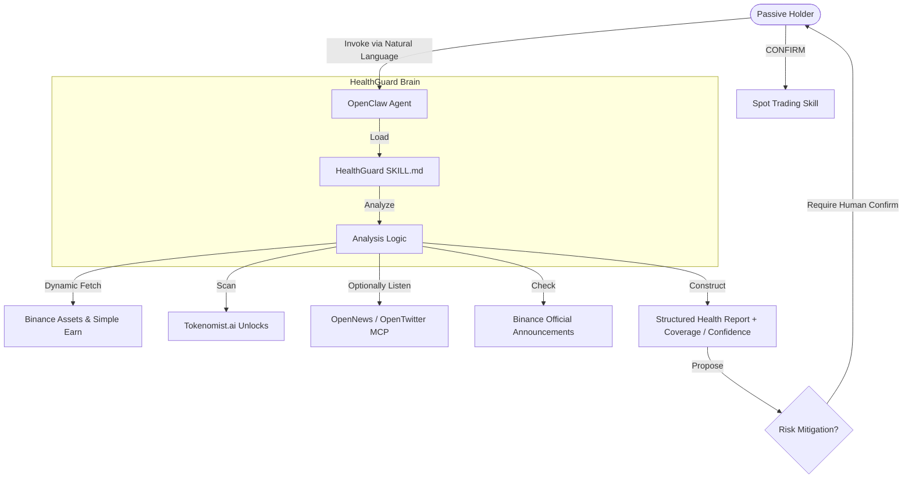

# Binance HealthGuard System Architecture

## 🏗️ The AI-Native Guardrail Model
Unlike traditional bots, HealthGuard is an **Instruction-Defined System (IDS)**. It leverages the OpenClaw Agent as its engine and Binance Official Skills as its peripherals.

## 🔐 The Multi-Layer Safety Matrix
To eliminate "Production Risks," we enforce three layers of security:
1. **Instructional Isolation**: No trading skill is loaded by the Agent until the user explicitly enters "Mode B (Guardian)".
2. **Key Minimization**: Recommended default usage with **API Access: View-Only**.
3. **Physical Isolation**: Credential files are excluded from Git and recommended to be stored in an OS-level restricted directory.

## 📊 Data Flow Orchestration
1. **Reconnaissance**: Merge Spot balances + Earn balances into a unified weighted portfolio.
2. **Thresholding**: Automatically classify assets into **major holdings (>=10 USDT)** and **minor holdings (<10 USDT)**.
3. **Automatic Deep Analysis**: For every major holding, run the default analysis stack: exchange status, unlocks, technicals, plus optional news/social enrichment when available.
4. **Degraded Intelligence Handling**: If optional intelligence providers are missing, continue the report and downgrade coverage / confidence instead of aborting.
5. **Correlation**: Cross-reference price volatility with upcoming unlocks, exchange status, and macro/news sentiment.
6. **Synthesis**: Convert complex raw data into a human-readable “Medical Prescription” (take-action recommendation) while keeping minor holdings compressed into summary form.
